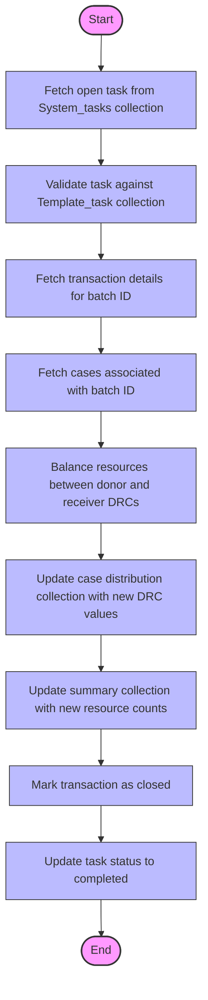

```mermaid
flowchart TD
    %% Start of the process
    A([Start]) --> B[Fetch open task from System_tasks collection]
    
    %% Task validation
    B --> C[Validate task against Template_task collection]
    C --> D[Fetch transaction details for batch ID]
    D --> E[Fetch cases associated with batch ID]
    
    %% Resource balancing
    E --> F[Balance resources between donor and receiver DRCs]
    F --> G[Update case distribution collection with new DRC values]
    G --> H[Update summary collection with new resource counts]
    
    %% Final steps
    H --> I[Mark transaction as closed]
    I --> J[Update task status to completed]
    J --> K([End])
    
    %% Styling for professional appearance
    classDef startEnd fill:#f9f,stroke:#333,stroke-width:2px;
    classDef process fill:#bbf,stroke:#333,stroke-width:1px;
    class A,K startEnd;
    class B,C,D,E,F,G,H,I,J process;
```
